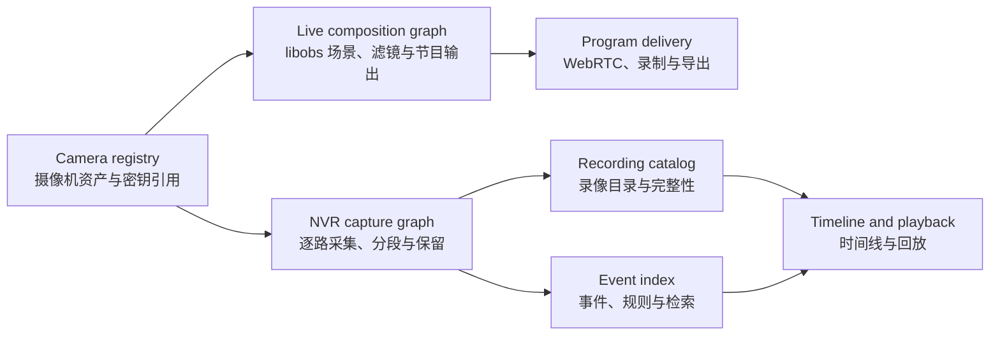

# v1.1–v2 product roadmap / v1.1–v2 产品路线

> Status / 状态：Planning baseline / 规划基线
>
> Last updated / 最后更新：2026-08-24
>
> Current position / 当前位置：`v1-M9` is complete. `v1-M10` is in progress: Camera Registry, stable Camera/Profile references, adapter contracts, bounded WS-Discovery, and authenticated Profile T/S media synchronization are implemented; PTZ/events/talk and vendor exit-gate coverage remain / `v1-M9` 已完成；`v1-M10` 实施中：Camera Registry、稳定 Camera/Profile 引用、Adapter 契约、有界 WS-Discovery及带认证的 Profile T/S 媒体同步已落地，PTZ/事件/对讲及厂商门禁仍待完成

This document expands the project from a web camera compositor into a self-hosted and local-first monitoring workspace with three first-class capabilities: an OBS-inspired customizable canvas, an NVR workflow inspired by mainstream monitoring applications such as tinyCam Monitor, and v2 True Direct local clients that keep Docker outside the media data plane. It is a capability plan, not a compatibility or UI-cloning claim, and it does not promise release dates.

本文把项目从 Web 摄像头合成器扩展为自托管且本地优先的监控工作台，并将三类能力作为一等功能：受 OBS 启发的可自定义画布、参考 tinyCam Monitor 等主流监控软件的 NVR 工作流，以及让 Docker 退出媒体数据面的 v2 真直连本地客户端。本规划描述能力目标，不表示兼容或复刻其界面，也不承诺发布日期。

## 1. Product goal / 产品目标

The target is one web application that can serve both a production operator and a security-camera operator:

目标是用同一个 Web 应用同时服务“节目画布操作者”和“监控值守操作者”：

- **Studio workspace / 画布工作台：** compose cameras, webpages, images, text, media, nested scenes, filters, and transitions into one or more program outputs / 将摄像头、网页、图片、文字、媒体、嵌套场景、滤镜和转场编排为一个或多个节目输出。
- **Monitor workspace / 监控工作台：** view many cameras, control PTZ/audio, inspect health, switch layouts, and react to alarms / 多路查看摄像头、控制 PTZ/音频、检查健康、切换布局并处置告警。
- **NVR workspace / 录像工作台：** continuously archive each camera independently, apply retention, search a timeline, replay synchronized cameras, and export evidence / 独立连续归档每路摄像头，执行保留策略，通过时间线检索，多路同步回放并导出证据。
- **Local client workspace / 本地客户端工作台：** Android and desktop runtimes reuse the registry and canvas while connecting to approved camera profiles directly / Android 与桌面运行端复用资产库和画布，并直接连接获批摄像机 Profile。
- **One secure, optional control plane / 一个安全且可选的控制面：** use one camera registry, permission model, audit trail, and secret boundary across all workspaces; v2 True Direct does not require Docker to carry media / 所有工作台共用摄像机资产库、权限模型、审计记录和凭据边界；v2 真直连不要求 Docker 承载媒体。

Reliability takes priority over visual breadth: continuous recording and retention must remain correct even when the editor, live preview, analytics, or notification delivery fails.

可靠性优先于功能数量：即使编辑器、实时预览、分析或通知发送失败，连续录像与保留策略也必须保持正确。

## 2. Architecture boundary / 架构边界

### One registry, two execution graphs / 一份资产，两条执行链



- A camera has one stable ID, capability record, main/substream profile, and references to externally mounted secrets. URLs containing credentials never appear in public scene documents, API responses, logs, metrics, exports, or Git / 每台摄像机只有一个稳定 ID、能力记录、主/子码流配置及外部挂载密钥的引用；含凭据 URL 不进入公开场景文档、API 响应、日志、指标、导出或 Git。
- The **live composition graph** is a libobs scene graph. It is allowed to decode, transform, mix, transition, and encode for a program output / **实时合成链**是 libobs 场景图，可以为节目输出进行解码、变换、混音、转场和编码。
- The **NVR capture graph** records each camera independently and prefers packet remux/stream copy when the input codec and destination permit it. Canvas edits and program transitions must not interrupt this graph / **NVR 采集链**独立录制每路摄像头；输入编码与目标封装允许时优先重封装/码流复制，画布编辑和节目转场不得中断该链。
- Program recordings and per-camera archives are different products. A composed program may be recorded, but it cannot be treated as the only forensic archive / 节目录像与逐路归档是两种不同产物；合成节目可以录制，但不能作为唯一取证归档。
- The single-node server installation remains one product image. Test fixtures may use extra containers. `v2-M6` may run the same signed server image in explicit controller/recorder roles, while single-node mode remains supported; native/local clients are separate deliverables, not hidden server containers / 单节点服务端部署继续只使用一个产品镜像，测试夹具可以使用额外容器；`v2-M6` 可让同一签名服务端镜像以 controller/recorder 角色运行，同时继续支持单节点模式；原生/本地客户端是独立交付物，不是隐藏的服务端容器。

### Persistent data domains / 持久化数据域

| Domain / 数据域 | Contents / 内容 | Required property / 必要属性 |
| --- | --- | --- |
| Camera registry / 摄像机资产库 | IDs, labels, stream profiles, capability cache, secret references / ID、名称、码流配置、能力缓存、密钥引用 | No embedded plaintext credentials / 不内嵌明文凭据 |
| Scene collection / 场景集合 | Scenes, groups, sources, filters, transitions, templates / 场景、组、来源、滤镜、转场、模板 | Versioned, atomically migrated, shared by client/server / 版本化、原子迁移、前后端共用 |
| Recording catalog / 录像目录 | Segment times, tracks, paths, checksums, lock/retention state / 分段时间、轨道、路径、校验和、锁定与保留状态 | Crash-recoverable and idempotently reconciled / 崩溃可恢复、可幂等对账 |
| Event index / 事件索引 | Motion/device/analytics/health/manual events and clip links / 移动、设备、分析、健康、人工事件及录像关联 | Normalized timestamps and bounded retention / 统一时间戳与有界保留 |
| Audit/security / 审计与安全 | Authentication, configuration, PTZ/talk, export, deletion actions / 认证、配置、PTZ/对讲、导出、删除操作 | Redacted, append-oriented, access controlled / 脱敏、追加式、受权限控制 |

SQLite in WAL mode plus local volumes is the initial single-node metadata baseline. A distributed database is not introduced until scale evidence justifies the operational cost.

单节点元数据首先采用 SQLite WAL 与本地卷；在规模证据足以证明运维成本合理之前，不引入分布式数据库。

## 3. Capability map / 能力归属

| Capability family / 能力族 | Planned milestone / 计划里程碑 | Product interpretation / 本项目实现边界 |
| --- | --- | --- |
| Multiple scenes, nested scenes/groups, source transforms / 多场景、场景嵌套/分组、来源变换 | `v1-M7` | Versioned scene collection shared by editor and libobs / 编辑器与 libobs 共用版本化场景集合 |
| Studio preview/program, transitions, source filters / 预览/节目双总线、转场、来源滤镜 | `v1-M7` | Deliberate web subset; unsupported Gateway Direct operations are explicit / 精选 Web 子集；网关直通不支持项必须明确标识 |
| Continuous per-camera DVR, quotas, retention / 逐路连续 DVR、配额、保留策略 | `v1-M8` | Independent from program composition; stream copy preferred / 独立于节目合成，优先码流复制 |
| Archive browser, timeline, synchronized playback, export / 归档浏览、时间线、同步回放、导出 | `v1-M9` | Gaps, integrity, time zones, permissions and audit are first-class / 将断档、完整性、时区、权限和审计作为一等能力 |
| Discovery, ONVIF profiles, PTZ, presets, talk / 发现、ONVIF、PTZ、预置位、对讲 | `v1-M10` | Profile T first; Profile S compatibility only; bounded discovery / Profile T 优先，Profile S 仅兼容，发现范围受控 |
| Motion zones, device events, object providers, rules / 移动区域、设备事件、目标提供器、规则 | `v1-M11` | Recording cannot depend on analytics; no biometric identity by default / 录像不依赖分析；默认不做生物身份识别 |
| True Direct topology, negotiation and proof / 真直连拓扑、协商与证明 | `v2-M1` | Docker carries no video payload in True Direct / 真直连时 Docker 不承载视频负载 |
| Desktop and Android local runtimes / 桌面与 Android 本地运行端 | `v2-M2`–`v2-M3` | Shared local media/canvas core with platform-secure credentials / 共用本地媒体/画布核心与平台安全凭据 |
| Offline registry/scene authorization and sync / 离线资产、场景授权与同步 | `v2-M4` | Encrypted, expiring and revocable local state / 加密、可过期、可撤销的本地状态 |
| Grid/tour/kiosk/PWA and operator roles / 宫格、轮巡、值守、PWA 与角色 | `v2-M5` | One operator workflow across web and local runtimes / Web 与本地运行端共用值守工作流 |
| Multi-volume, remote recorder roles, integrations, disaster recovery / 多存储卷、远程录像节点、集成、灾难恢复 | `v2-M6` | Optional scale-out without removing the one-image single-node path / 可选横向扩展，不取消单镜像单节点路径 |

## 4. Milestone sequence / 里程碑顺序

`v1.0` contains `v1-M1` through `v1-M6`. `v1.1` contains `v1-M7` through `v1-M11`: Canvas Studio, NVR Core and Timeline are complete, while `v1-M10` Device Operations is current. `v2.0` starts at `v2-M1` and introduces True Direct as a separately measured topology, not a rename of the current MediaMTX relay.

`v1.0` 包含 `v1-M1` 至 `v1-M6`。`v1.1` 包含 `v1-M7` 至 `v1-M11`：画布工作台、NVR Core 与时间线已完成，当前位于 `v1-M10` 设备运维。`v2.0` 从 `v2-M1` 开始，把真直连作为单独测量的拓扑，而不是给当前 MediaMTX 转发链改名。

```text
v1.0: v1-M1 … v1-M6 (complete)
v1.1: v1-M7 Canvas -> v1-M8 NVR -> v1-M9 Timeline -> v1-M10 Device Ops (current) -> v1-M11 Events
v2.0: v2-M1 True Direct -> v2-M2 Desktop -> v2-M3 Android -> v2-M4 Offline Sync -> v2-M5 Operator UX -> v2-M6 Scale

v1.0：v1-M1 … v1-M6（完成）
v1.1：v1-M7 画布 -> v1-M8 NVR -> v1-M9 时间线 -> v1-M10 设备运维（当前）-> v1-M11 事件
v2.0：v2-M1 真直连 -> v2-M2 桌面端 -> v2-M3 Android -> v2-M4 离线同步 -> v2-M5 值守体验 -> v2-M6 扩展
```

### v1-M7 — Canvas Studio / 画布工作台

**Goal / 目标：** turn the existing single-scene editor into a persistent scene collection and an OBS-inspired web production workflow without creating a second client-only layout model / 将现有单场景编辑器升级为持久化场景集合与受 OBS 启发的 Web 制作流程，同时不产生客户端专属的第二套布局模型。

**Scope / 范围：**

- Multiple named scenes; duplicate, reorder, import/export, and reusable templates / 多个命名场景，复制、排序、导入导出和可复用模板。
- Scene-as-source, shared sources, groups, two-level nesting validation, source lock, visibility, and multi-select / 场景作为来源、共享来源、分组、两级嵌套校验、来源锁定、可见性和多选。
- Image, text, solid-color, media, RTSP, browser, and nested-scene sources / 图片、文字、纯色、媒体、RTSP、浏览器和嵌套场景来源。
- Canvas zoom, pan, rulers, safe areas, grids, snapping, guides, align/distribute, fit/fill/stretch/center, crop, rotate, and numeric transforms / 画布缩放、平移、标尺、安全区、网格、吸附、参考线、对齐/分布、适应/填充/拉伸/居中、裁切、旋转和数值变换。
- Undo/redo command history with bounded memory and clear save state / 有内存上限并明确保存状态的撤销/重做命令历史。
- Ordered filter stack starting with crop/pad, opacity/color correction, mask/blend, LUT, scaling and delay where supported / 有序滤镜栈，首批包含裁切/填充、透明度/颜色校正、遮罩/混合、LUT、缩放及支持条件下的延迟。
- Studio mode with isolated Preview and Program scenes, `Cut` and `Fade` first, transition duration, and an atomic Take operation / Preview 与 Program 隔离的 Studio 模式，首批提供 `Cut`、`Fade`、转场时长和原子 Take。
- Multiview showing Preview, Program, and selected scene thumbnails / 显示 Preview、Program 和选定场景缩略图的多画面监看。
- An explicit capability matrix for Composite, Direct, and Hybrid modes. The UI must offer a safe Composite fallback instead of silently dropping an unsupported filter or nested source / 为 Composite、Direct、Hybrid 建立明确能力矩阵；不支持滤镜或嵌套来源时，UI 必须提供安全 Composite 回退，不能静默忽略。
- Scene schema migration with pre-migration backup, validation, atomic replace, and rollback / 场景 schema 迁移包含迁移前备份、校验、原子替换和回滚。

**Not in M7 / M7 不包含：** arbitrary OBS plug-in loading, desktop window/game capture, unrestricted scripts, and pixel-perfect replication of the OBS desktop UI / 任意 OBS 插件加载、桌面窗口/游戏采集、不受限脚本以及 OBS 桌面 UI 的像素级复刻。

**Exit gate / 完成门禁：**

- A deterministic collection with at least five scenes, shared sources, nested scenes/groups, filters, and mixed source types survives create/edit/save/restart/migration / 至少五个场景并包含共享来源、嵌套场景/组、滤镜及混合来源类型的确定性集合通过创建、编辑、保存、重启和迁移。
- Preview edits do not alter Program before Take; 500 automated Cut/Fade operations complete without deadlock, stale state, audio discontinuity outside the transition policy, or black program frames / Preview 编辑在 Take 前不影响 Program；500 次自动 Cut/Fade 不出现死锁、状态陈旧、策略外音频中断或节目黑帧。
- Undo/redo produces byte-equivalent canonical scene state after a round trip; concurrent edits still obey revision preconditions / 撤销/重做往返后生成字节等价的规范场景状态，并发编辑继续遵守 revision 前置条件。
- Direct/Hybrid tests prove every unsupported operation is disclosed and routed to Composite or rejected before activation / Direct/Hybrid 测试证明每个不支持操作都会明确显示，并在激活前回退 Composite 或被拒绝。
- Existing M0–M6 recording, WebRTC, browser-source, audio, security, redaction, and recovery suites remain green / M0–M6 录像、WebRTC、浏览器来源、音频、安全、脱敏和恢复套件保持通过。

### v1-M8 — NVR Core / NVR 核心

**Goal / 目标：** add crash-tolerant, per-camera continuous recording and retention that is operationally independent from the canvas and program output / 增加可抗崩溃的逐路连续录像与保留策略，并在运行上独立于画布和节目输出。

**Scope / 范围：**

- Per-camera recording jobs with `continuous`, `scheduled`, `event`, and `off` policies / 逐路录像任务支持 `continuous`、`scheduled`、`event` 和 `off` 策略。
- Main/substream selection and stream-copy/remux preference for compatible H.264/H.265/audio, with explicit transcode fallback / 可选主/子码流；兼容的 H.264/H.265/音频优先码流复制/重封装，不兼容时显式转码回退。
- Configurable crash-tolerant segments, UTC-normalized timestamps, monotonic duration accounting, and safe finalization / 可配置的抗崩溃分段、UTC 归一化时间戳、单调时钟时长核算和安全封装。
- SQLite WAL recording catalog containing camera/segment IDs, time range, tracks, codec, size, integrity status, storage location, and retention lock / SQLite WAL 录像目录记录摄像机/分段 ID、时间范围、轨道、编码、大小、完整性、存储位置及保留锁。
- Global and per-camera age/quota policies, minimum free-space reserve, oldest-eligible deletion, evidence lock, and disk-pressure state / 全局及逐路时长/配额策略、最低剩余空间、最旧可删项清理、证据锁和磁盘压力状态。
- Startup recovery that finalizes or quarantines partial files, reconciles orphan files/catalog rows idempotently, and never reports an unverified segment as healthy / 启动恢复可封装或隔离残片，幂等对账孤立文件/目录记录，且不把未经验证的分段报告为健康。
- Recording health, write latency, bytes, failures, retention actions, and free-space metrics without path or credential disclosure / 提供录像健康、写延迟、字节数、失败、保留动作和剩余空间指标，不泄漏路径或凭据。
- A bounded in-memory/on-disk pre-event ring foundation for M11 / 为 M11 建立有界内存/磁盘事件前环形缓冲底座。

**Not in M8 / M8 不包含：** object detection, a forensic search UI, cloud archive, or multi-node coordination / 目标检测、取证搜索 UI、云归档或多节点协调。

**Exit gate / 完成门禁：**

- Four deterministic 1080p H.264 fixtures pass a six-hour automated stream-copy soak; a documented private 24-hour burn-in passes before M8 is marked complete / 四路确定性 1080p H.264 夹具通过六小时自动码流复制耐久测试；M8 完成前另通过有记录且不公开端点的 24 小时真实耐久测试。
- Killing the container at arbitrary segment phases preserves every previously completed segment and loses no more than the active segment; repeated recovery is idempotent / 在任意分段阶段强制终止容器，所有已完成分段保持可播放，损失不超过活动分段；重复恢复保持幂等。
- Canvas edits, scene transitions, UI restart, and program-output restart do not interrupt per-camera archives / 画布编辑、场景转场、UI 重启和节目输出重启不打断逐路归档。
- Quota, age, free-space reserve, evidence lock, clock rollback, duplicate timestamps, unwritable volume, and full-disk paths pass deterministic tests / 配额、时长、剩余空间、证据锁、时钟回拨、重复时间戳、不可写卷和磁盘写满路径通过确定性测试。
- Catalog indexes, logs, metrics, backups, and support bundles contain stable camera IDs rather than source URLs or secrets / 目录索引、日志、指标、备份和支持包只包含稳定摄像机 ID，不包含来源 URL 或密钥。

### v1-M9 — Timeline, Playback & Evidence / 时间线、回放与证据

**Goal / 目标：** make continuous archives operationally useful through fast search, synchronized replay, and auditable export / 通过快速检索、同步回放和可审计导出，让连续归档真正可用。

**Scope / 范围：**

- Calendar/day timeline with continuous/event/manual markers, offline gaps, retention boundaries, and per-camera availability / 带连续/事件/人工标记、离线断档、保留边界和逐路可用性的日历/日时间线。
- Single- and multi-camera playback, synchronized play/pause/seek, speed control, frame step where supported, and automatic main/substream selection / 单路及多路回放、同步播放/暂停/跳转、倍速、支持条件下逐帧及主/子码流自动选择。
- Thumbnail/storyboard generation with bounded background work and cache retention / 有界后台生成缩略图/故事板并执行缓存保留。
- Fast stream-copy clip export when possible, explicit exact-boundary re-encode mode, snapshots, program-recording association, and evidence locks / 可行时快速码流复制导出；另提供显式精确边界重编码、快照、节目录像关联和证据锁。
- SHA-256 export manifest containing requested/effective time range, tracks, source camera IDs, file hashes, software version, and audit ID—but no credentials / SHA-256 导出清单记录请求/实际时间范围、轨道、来源摄像机 ID、文件哈希、软件版本和审计 ID，但不含凭据。
- Time-zone and daylight-saving display isolated from UTC storage; explicit handling of gaps, duplicate wall-clock times, discontinuities, and corrupt segments / 显示时区与 UTC 存储隔离，明确处理夏令时断档、重复墙钟时间、时间不连续及损坏分段。
- Permission checks and audit events for playback, snapshot, export, lock, unlock, and delete / 对回放、截图、导出、锁定、解锁和删除执行权限检查与审计。

**Exit gate / 完成门禁：**

- On the published reference hardware/storage profile, local archive queries and ordinary seeks meet a documented p95 latency budget; results never cross camera or tenant-like authorization boundaries / 在公开的参考硬件/存储配置上，本地归档查询和普通跳转达到有记录的 p95 延迟预算；结果不会跨越摄像机或类似租户的授权边界。
- Four-camera synchronized playback stabilizes within 250 ms, visibly represents gaps, and recovers after one corrupt or missing segment / 四路同步回放稳定后偏差不超过 250 ms，明确显示断档，并能跨越一个损坏或缺失分段恢复。
- Fast export reports keyframe-aligned effective boundaries; exact mode stays within one output frame of the request and both modes produce playable, hash-verifiable files / 快速导出报告按关键帧对齐的实际边界；精确模式与请求误差不超过一个输出帧，两种模式均生成可播放、哈希可验证文件。
- UTC, multiple display zones, daylight-saving transitions, leap-day, clock rollback, and retention-during-playback cases pass / UTC、多显示时区、夏令时切换、闰日、时钟回拨及回放期间保留清理场景通过。

### v1-M10 — Device Operations & ONVIF / 设备运维与 ONVIF

**Goal / 目标：** manage cameras as devices rather than opaque RTSP URLs, with bounded discovery and capability-driven controls / 将摄像机作为设备而非不透明 RTSP URL 管理，并提供有边界的发现和能力驱动控制。

**Scope / 范围：**

- Manual add remains the default. Optional WS-Discovery is limited to explicitly selected interfaces/subnets, duration, and result count; it never scans every reachable network by default / 手工添加保持默认；可选 WS-Discovery 仅限显式选择的接口/子网、时长和结果数，默认不扫描所有可达网络。
- ONVIF Profile T is the primary media/control target. Profile S is a compatibility fallback, not the basis for new security assumptions / ONVIF Profile T 是主要媒体/控制目标；Profile S 仅作兼容回退，不作为新安全假设的基础。
- Capability negotiation for media profiles, H.264/H.265, resolution/FPS, main/substream, snapshot, audio, imaging, events, PTZ, presets, home, patrol, and I/O / 协商媒体配置、H.264/H.265、分辨率/FPS、主/子码流、快照、音频、成像、事件、PTZ、预置位、归位、巡航和 I/O 能力。
- Capability-driven UI: unsupported buttons are absent or disabled with a reason; vendor extensions are isolated behind adapters / UI 由能力驱动；不支持的按钮隐藏或禁用并说明原因，厂商扩展隔离在适配器后。
- PTZ velocity/absolute/relative moves, presets, guarded patrol/home operations, rate limits, automatic stop on pointer/network/session loss, and audit / PTZ 速度/绝对/相对移动、预置位、受保护的巡航/归位、限速、指针/网络/会话丢失自动 Stop 及审计。
- Push-to-talk/two-way audio only for supported devices, explicit user hold-to-talk, operator permission, visible active state, timeout, and audit / 仅对支持设备提供按住说话式双向音频，并要求操作员权限、明确激活状态、超时和审计。
- Profile G edge-recording search/retrieval adapter and Profile M event/metadata intake are optional capability paths, not prerequisites for ordinary RTSP cameras / Profile G 边缘录像检索适配与 Profile M 事件/元数据接入是可选能力，不成为普通 RTSP 摄像机的前置条件。
- Device health covers reachability, media profile drift, clock offset, event subscription, PTZ/talk state, and credential expiry without returning secret values / 设备健康覆盖可达性、媒体配置漂移、时钟偏差、事件订阅、PTZ/对讲状态和凭据过期，但不返回密钥值。

**Exit gate / 完成门禁：**

- A pinned ONVIF emulator plus at least three privately documented vendor/device combinations pass media discovery and applicable controls; public results identify capability classes, not private addresses or credentials / 固定 ONVIF 模拟器及至少三组私下记录的厂商/设备组合通过媒体发现和适用控制；公开结果只标识能力类别，不含私有地址或凭据。
- Profile T primary and Profile S fallback paths both pass digest/TLS capability tests appropriate to the device; insecure fallback requires an explicit LAN-only warning and opt-in / Profile T 主路径与 Profile S 回退路径分别通过设备适用的 digest/TLS 能力测试；不安全回退要求显式局域网警告和选择加入。
- Discovery scope, duplicate devices, IP changes, clock skew, malformed XML, slow devices, subscription renewal, and partial capabilities pass deterministic tests / 发现范围、重复设备、IP 变化、时钟偏差、畸形 XML、慢设备、订阅续期和部分能力通过确定性测试。
- PTZ/talk permission denial, rate limiting, disconnect auto-stop, stuck-key/pointer cancellation, and audit redaction pass / PTZ/对讲权限拒绝、限速、断连自动 Stop、卡键/指针取消和审计脱敏通过。

### v1-M11 — Events, Detection & Automation / 事件、检测与自动化

**Goal / 目标：** normalize camera and software events into searchable incidents and bounded automations without allowing analytics to block recording / 将摄像机与软件事件统一为可搜索事件和有界自动化，同时保证分析不阻塞录像。

**Scope / 范围：**

- Normalized event schema for motion, tamper, line/region crossing, object, sound, input, device health, recording failure, manual marker, and rule result / 为移动、遮挡、越线/区域、目标、声音、输入、设备健康、录像失败、人工标记和规则结果建立统一事件 schema。
- Camera-native ONVIF event/metadata ingestion first; software motion detection with include/exclude zones, masks, sensitivity, schedules, debounce, cooldown, and per-camera resource ceilings / 优先接入摄像机原生 ONVIF 事件/元数据；软件移动检测提供包含/排除区域、遮罩、灵敏度、计划、去抖、冷却和逐路资源上限。
- Pre-event/post-event recording and event-to-segment linkage that reference immutable segment IDs instead of copying media unnecessarily / 事件前/后录像及事件到分段的关联优先引用不可变分段 ID，避免不必要复制媒体。
- A versioned detector-provider interface with optional CPU/GPU providers. Initial labels may include person, vehicle, and animal, but the recorder remains healthy when no detector exists or the provider crashes / 建立版本化检测提供器接口及可选 CPU/GPU 提供器；首批标签可包含人、车辆和动物，但无检测器或提供器崩溃时录像仍保持健康。
- Rule builder using camera, zone, label, confidence, schedule, duration, cooldown, and health predicates / 规则构建器支持摄像机、区域、标签、置信度、计划、持续时间、冷却和健康条件。
- Notification outbox with retries, deduplication, expiration and rate limits; webhook and MQTT first, then email/push adapters / 通知发件箱具备重试、去重、过期和限速；先支持 Webhook 与 MQTT，再增加邮件/推送适配器。
- Event search by time, camera, type, zone, label, acknowledgement, and recording availability; incident acknowledgement and notes are audited / 可按时间、摄像机、类型、区域、标签、确认状态和录像可用性搜索；事件确认和备注需审计。
- Privacy zones and event/thumbnail retention independent from recording retention / 隐私区域以及独立于录像保留的事件/缩略图保留策略。

**Not in M11 / M11 不包含：** biometric face identification, license-plate identity databases, emotion inference, or covert tracking defaults. Such high-risk functions require a separate threat/legal review and are not core commitments / 生物人脸身份识别、车牌身份数据库、情绪推断或默认隐蔽追踪；此类高风险功能需要独立威胁/法律审查，不属于核心承诺。

**Exit gate / 完成门禁：**

- Recording remains within its M8 health/error budget while event intake, detector providers, notifications, and search are independently stopped, overloaded, restarted, or malformed / 事件接入、检测提供器、通知及搜索分别停止、过载、重启或收到畸形数据时，录像仍满足 M8 健康/错误预算。
- Ground-truth fixtures validate motion zones, masks, debounce, cooldown, pre/post-event coverage, event deduplication, and object-provider contract deterministically / 使用真值夹具确定性验证移动区域、遮罩、去抖、冷却、事件前后覆盖、事件去重和目标提供器契约。
- Native events link to viewable archive segments with a documented p95 event-to-index budget; notification retries cannot create an unbounded queue or alert storm / 原生事件在规定 p95 入库预算内关联可查看录像分段；通知重试不能形成无界队列或告警风暴。
- Webhook signing/secret files, MQTT credentials, redaction, SSRF controls, authorization, acknowledgement audit, and retention deletion pass security tests / Webhook 签名/密钥文件、MQTT 凭据、脱敏、SSRF 控制、授权、确认审计和保留删除通过安全测试。

### v2-M1 — True Direct Contract & Proof / 真直连契约与闭环

**Goal / 目标：** establish a topology in which an approved local client receives camera media without Docker carrying video payload, while retaining explicit Gateway Direct, Hybrid and Composite fallbacks / 建立获批本地客户端直接接收摄像机媒体且 Docker 不承载视频负载的拓扑，同时保留明确的网关直通、Hybrid 与 Composite 后备。

**Scope / 范围：** define a versioned media-path contract, per-source topology negotiation, server-byte/session diagnostics, a local reference receiver, and the enrollment/credential boundary. The v1 API value `direct` continues to mean Gateway Direct / 定义版本化媒体路径契约、逐来源拓扑协商、服务端字节/会话诊断、本地参考接收端及配对/凭据边界；v1 API 的 `direct` 继续表示网关直通。

**Exit gate / 完成门禁：** active True Direct viewing produces no corresponding camera upstream, MediaMTX reader, FFmpeg/libobs job or video payload on Docker after bounded control exchange; downgrade and credential tests pass and are visible before playback / 真直连活动时，在有界控制交换后 Docker 内不存在对应摄像机上游、MediaMTX reader、FFmpeg/libobs 作业或视频负载；降级与凭据测试通过且在播放前可见。完整门禁见 [true-direct-v2.md](true-direct-v2.md)。

### v2-M2 — Desktop Local Runtime / 桌面本地运行端

**Goal / 目标：** deliver the first offline-capable desktop reference client using the shared Camera Registry and canvas model, with local decode, composition and optional recording / 交付首个可离线的桌面参考客户端，复用 Camera Registry 与画布模型，在本地完成解码、编排和可选录像。

**Scope / 范围：** Windows/Linux reference packages, hardware decode fallback, 1/4/9/16 and custom canvas views, local companion mode for browser UI where justified, reconnect, diagnostics, signed updates and OS-backed secret storage / Windows/Linux 参考包、硬解回退、1/4/9/16 与自定义画布、本机伴随模式（确有必要时）、重连、诊断、签名更新及系统密钥存储。

**Exit gate / 完成门禁：** published reference hardware passes multi-camera True Direct, reconnect, sleep/resume, offline startup, revocation, update/rollback and secret-extraction tests without creating a server media session / 公开参考硬件通过多路真直连、重连、睡眠恢复、离线启动、撤销、升级回滚和密钥提取测试，且不创建服务端媒体会话。

### v2-M3 — Android Local Runtime / Android 本地运行端

**Goal / 目标：** provide a tinyCam-class Android monitoring surface that shares devices, layouts and policy with the server but performs approved live media work locally / 提供类似 tinyCam 使用方式的 Android 监看端，共享设备、布局和策略，但在本机执行获批实时媒体工作。

**Scope / 范围：** phone/tablet adaptive grids, hardware decode, foreground monitor mode, full screen and Wake Lock, PTZ/audio permissions, network handoff, battery/thermal budgets, encrypted offline state and explicit background limitations / 手机/平板自适应宫格、硬解、前台监看、全屏与常亮、PTZ/音频权限、网络切换、电量/温控预算、加密离线状态及明确后台限制。

**Exit gate / 完成门禁：** supported Android profiles pass local True Direct, 1/4/9/16-tile resource budgets, lifecycle/network transitions, permission denial, credential revocation and app-update migration; unsupported background behavior is disclosed / 受支持 Android 配置通过本地真直连、1/4/9/16 宫格资源预算、生命周期/网络切换、权限拒绝、凭据撤销与应用升级迁移；不支持的后台行为必须明确展示。

### v2-M4 — Offline Authorization & Sync / 离线授权与同步

**Goal / 目标：** make one registry and canvas usable across server, desktop and Android without turning the server database or administrator password into a portable secret / 让一份资产库与画布可在服务端、桌面和 Android 间使用，同时不把服务端数据库或管理员密码变成可携带密钥。

**Scope / 范围：** device enrollment, scoped grants, encrypted local cache, expiry/revocation, conflict-aware scene sync, schema migration, offline audit queue and explicit local-only profiles / 设备配对、范围授权、加密本地缓存、过期/撤销、场景冲突同步、schema 迁移、离线审计队列及明确的仅本地 Profile。

**Exit gate / 完成门禁：** deterministic offline/online conflict, expiry, lost-device revocation, clock skew, backup/restore, migration and credential-redaction matrices pass across all published clients / 所有公开客户端通过确定性离线/在线冲突、过期、遗失设备撤销、时钟偏差、备份恢复、迁移与凭据脱敏矩阵。

### v2-M5 — Operator, Mobile & Kiosk UX / 值守、移动与大屏体验

**Goal / 目标：** make Studio, Monitor, and NVR workflows usable from desktop, touch, wall display, and installable PWA surfaces with least-privilege roles / 让 Studio、Monitor 和 NVR 工作流可在桌面、触摸、大屏值守和可安装 PWA 上使用，并贯彻最小权限角色。

**Scope / 范围：**

- Separate Studio, Monitor, Events, Playback, Devices, Storage, and Administration workspaces with a consistent camera identity and navigation model / 提供 Studio、监看、事件、回放、设备、存储和管理工作区，并统一摄像机身份与导航。
- Grid presets (1/4/9/16), custom canvas views, favorites, groups, full screen, sequence/tour, focus mode, digital zoom, snapshots, and manual record markers / 宫格预设（1/4/9/16）、自定义画布视图、收藏、分组、全屏、轮巡、聚焦、数字变焦、截图和手工录像标记。
- Automatic main/substream selection based on tile size, visibility, bandwidth, decode budget, and foreground state; manual override remains visible / 根据画面尺寸、可见性、带宽、解码预算及前后台状态自动选择主/子码流，并保留可见的手工覆盖。
- Responsive PWA, reconnect-safe state, install/update UX, background notification handling where the platform permits, and touch-safe PTZ/talk controls / 响应式 PWA、可重连状态、安装/更新体验、平台允许时的后台通知，以及触摸安全的 PTZ/对讲控制。
- Kiosk/TV mode with read-only signed session, burn-in-aware rotation, health banner, offline tiles, and remote revocation / Kiosk/TV 模式使用只读签名会话，支持防烧屏轮换、健康横幅、离线画面和远程撤销。
- Roles at minimum `admin`, `operator`, `viewer`, `auditor`, and `exporter`, with camera/group scopes and explicit permissions for talk, PTZ, playback, export, delete, settings, and user management / 至少提供 `admin`、`operator`、`viewer`、`auditor`、`exporter` 角色，支持摄像机/组范围，并明确对讲、PTZ、回放、导出、删除、设置和用户管理权限。
- Keyboard and touch navigation, screen-reader labels, visible focus, reduced motion, color-independent alarms, and documented browser support / 支持键盘与触摸导航、屏幕阅读标签、可见焦点、减少动画、不依赖颜色的告警及有记录的浏览器支持范围。

**Boundary / 边界：** Android is delivered by `v2-M3`; `v2-M5` unifies operator workflows across Web/PWA, desktop and Android rather than treating a PWA as a substitute for local RTSP support. iOS/TV remain separate evidence-driven decisions / Android 由 `v2-M3` 交付；`v2-M5` 统一 Web/PWA、桌面与 Android 的值守流程，而不是把 PWA 当作本地 RTSP 支持的替代品。iOS/TV 仍需单独证据驱动决策。

**Exit gate / 完成门禁：**

- The published reference profile sustains a 16-tile monitor using adaptive substreams while recording continues within M8 budgets; hidden/offscreen tiles release decode resources predictably / 公开参考配置以自适应子码流稳定运行 16 宫格，同时录像保持 M8 预算；隐藏/离屏画面可预测地释放解码资源。
- Desktop Chromium, one supported Android Chromium PWA, and kiosk browser runs pass reconnect, resume, upgrade prompt, notification, touch PTZ, talk timeout, and offline-state tests / 桌面 Chromium、一种受支持 Android Chromium PWA 和值守浏览器通过重连、恢复、升级提示、通知、触摸 PTZ、对讲超时和离线状态测试。
- The complete role/camera-scope matrix is deny-by-default and is exercised across UI, REST, WebSocket, media playback, export, PTZ, talk, metrics, and administration / 完整角色/摄像机范围矩阵默认拒绝，并覆盖 UI、REST、WebSocket、媒体回放、导出、PTZ、对讲、指标和管理面。
- Core live monitoring and incident review pass keyboard-only, screen-reader smoke, visible-focus, contrast, and reduced-motion checks / 核心实时监看与事件复核通过纯键盘、屏幕阅读冒烟、可见焦点、对比度和减少动画检查。

### v2-M6 — Scale, Ecosystem & Resilience / 扩展、生态与韧性

**Goal / 目标：** scale beyond one host and one storage volume without weakening the simple single-image deployment, security boundary, or recoverability / 在不削弱单镜像部署、安全边界和可恢复性的前提下，扩展到多主机及多存储卷。

**Scope / 范围：**

- Multiple local storage volumes, per-camera placement, watermarks, evacuation, integrity scrub, tiering, and optional S3-compatible archive / 多本地存储卷、逐路放置、水位、迁移、完整性巡检、分层及可选 S3 兼容归档。
- The same signed product image may run explicit standalone, controller, recorder, or worker roles; mutual authentication and least-privilege enrollment are mandatory / 同一签名产品镜像可显式运行 standalone、controller、recorder 或 worker 角色，必须使用双向认证和最小权限注册。
- Remote recorder ownership leases, bounded failover, clock/health reporting, recording-location awareness, and isolated site operation during controller loss / 远程录像节点所有权租约、有界故障转移、时钟/健康报告、录像位置感知，以及 controller 丢失时的站点隔离运行。
- Versioned public API/events, signed webhooks, MQTT/Home Assistant adapters, and a sandboxed external analytics/export provider contract / 版本化公开 API/事件、签名 Webhook、MQTT/Home Assistant 适配器，以及沙箱化外部分析/导出提供器契约。
- CPU/GPU/decode/encode/detector resource scheduling with published hardware tiers and safe software fallbacks / CPU/GPU/解码/编码/检测资源调度，公布硬件档位并保留安全软件回退。
- Automated encrypted backups of configuration/catalog/audit keys, restore drills, media-catalog reconciliation, rolling schema migration, image provenance, staged upgrade, and rollback / 配置/目录/审计密钥自动加密备份、恢复演练、媒体目录对账、滚动 schema 迁移、镜像来源、分阶段升级和回滚。
- Optional external NVR/detector interoperability through documented adapters instead of embedding every model or vendor protocol / 通过有文档适配器与外部 NVR/检测器互操作，不把所有模型或厂商协议嵌入核心。

**Not in v2-M6 / v2-M6 不包含：** a hosted multi-tenant SaaS control plane, vendor P2P-cloud credential brokerage, access-control/door actuation, or a promise of unlimited camera density / 托管多租户 SaaS 控制面、厂商 P2P 云凭据代理、门禁/开门控制或无限摄像机密度承诺。

**Exit gate / 完成门禁：**

- Published hardware tiers pass repeatable 8/16/32-camera soak profiles with live view, recording, retention, events, and playback workloads; unsupported density fails admission explicitly instead of degrading silently / 公布的硬件档位通过可重复的 8/16/32 路实时查看、录像、保留、事件和回放耐久配置；超过支持密度时显式拒绝接纳，不能静默退化。
- Controller loss, one recorder loss, network partition, one storage-volume failure, low disk, expired node credential, and clock skew preserve defined recording ownership and converge without duplicate deletion or split-brain control / controller 丢失、单录像节点丢失、网络分区、单存储卷故障、低磁盘、节点凭据过期和时钟偏差时，保持定义的录像所有权，并在恢复后收敛且不重复删除或产生控制脑裂。
- A clean installation restores encrypted configuration/catalog backup, reconciles retained media, verifies audit/export hashes, and resumes within the documented recovery objectives / 全新安装可恢复加密配置/目录备份，对账保留媒体，验证审计/导出哈希，并在规定恢复目标内继续服务。
- Upgrade and rollback across every supported schema/image hop pass with signed images, SBOM/provenance verification, GPL corresponding-source availability, and no committed secrets / 所有受支持 schema/镜像跳转均通过签名镜像升级与回滚、SBOM/来源证明、GPL 对应源代码可得性及无已提交密钥检查。

## 5. Delivery rules / 交付规则

- **No calendar promises before evidence / 无证据不承诺日期：** estimates are published only after the preceding gate and a measured prototype expose resource and migration cost / 只有前置门禁和测量原型揭示资源与迁移成本后才公布时间估算。
- **Integrity before intelligence / 完整性优先于智能：** M8/M9 recording and replay correctness cannot be traded for M11 detection breadth / 不以 M8/M9 录像回放正确性换取 M11 检测广度。
- **Fail explicit / 显式失败：** unsupported codec, filter, device capability, permission, storage, or scale must be visible in API/UI and metrics / 不支持的编码、滤镜、设备能力、权限、存储或规模必须在 API/UI 和指标中可见。
- **Secure defaults / 安全默认：** LAN discovery, insecure ONVIF fallback, talk, external URLs, webhooks, cloud archive, and remote nodes require explicit enablement and bounded policy / 局域网发现、不安全 ONVIF 回退、对讲、外部 URL、Webhook、云归档及远程节点都需显式启用并受策略限制。
- **Private acceptance evidence / 私有验收证据：** real camera endpoints, credentials, recordings, snapshots, device serials, network ranges, notification destinations, and unredacted logs stay outside Git and public artifacts / 真实摄像机端点、凭据、录像、截图、设备序列号、网段、通知目的地和未脱敏日志不进入 Git 或公开产物。
- **Migration is a feature / 迁移也是功能：** every schema/storage change includes backup, dry-run validation, atomic activation, rollback boundaries, and an upgrade test from the previous supported release / 每次 schema/存储变更均包含备份、试运行校验、原子启用、回滚边界及从上一受支持版本升级的测试。

## 6. Reference basis / 参考依据

These sources inform the capability categories and protocol direction; they do not create a compatibility claim:

以下资料用于确定能力类别和协议方向，不构成兼容性声明：

- [OBS Studio Overview](https://obsproject.com/kb/obs-studio-overview), [Sources Guide](https://obsproject.com/kb/sources-guide), [Filters Guide](https://obsproject.com/kb/Filters-Guide), and [The Power of Projectors](https://obsproject.com/kb/power-of-projectors) for scenes, sources, transforms, filters, Studio Mode, and multiview concepts / 用于参考场景、来源、变换、滤镜、Studio Mode 和多画面概念。
- [tinyCam Monitor feature overview](https://www.tinycammonitor.com/index.html), [background mode](https://www.tinycammonitor.com/manual/background_mode.html), [app recording](https://tinycammonitor.com/manual/app_recording.html), and [motion detection](https://www.tinycammonitor.com/manual/camera_motion_detection.html) for multi-camera viewing, background DVR, quotas, pre/post-event recording, motion zones, PTZ/audio, and operator workflows / 用于参考多路监看、后台 DVR、配额、事件前后录像、移动区域、PTZ/音频和值守流程。
- ONVIF [Profile T](https://www.onvif.org/profiles/profile-t/), [Profile G](https://www.onvif.org/profiles/profile-g/), and [Profile M](https://www.onvif.org/profiles/profile-m/) for advanced streaming/control, edge recording retrieval, and analytics metadata/events / 用于高级流媒体/控制、边缘录像检索及分析元数据/事件。
- ONVIF's [Profile S deprecation Q&A](https://www.onvif.org/profiles/profile-s/profile-s-deprecation-qna/) for treating Profile S as compatibility-only and prioritizing Profile T / 用于将 Profile S 定位为兼容路径，并优先采用 Profile T。
